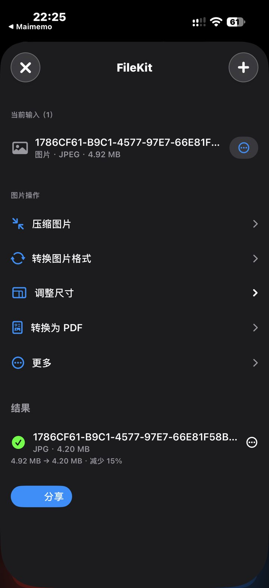
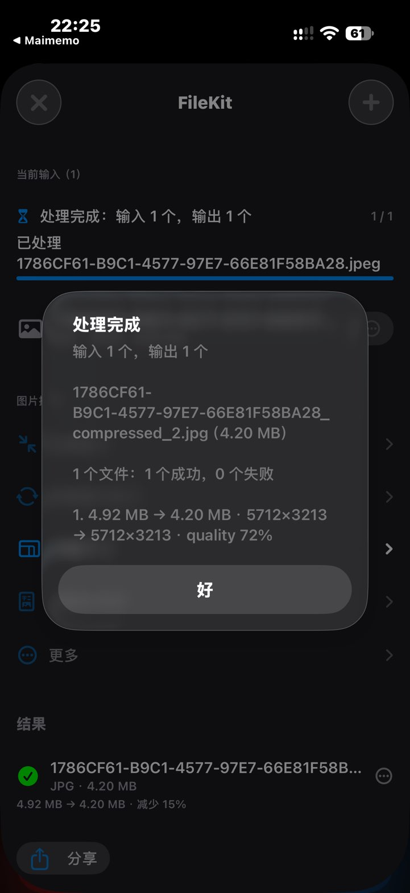

# FileKit 🧰

> A powerful, native-first file processing toolbox designed for iOS & iPadOS on [Scripting](https://scripting.app).
> 基于 Scripting 的 iOS 原生文件处理工具箱，支持图片、PDF、压缩包、Office 及文本的一站式快速处理与无缝管道式操作。

[](script.json)
[](https://scripting.app)
[](index.tsx)
[](LICENSE)
[](https://github.com/JiangWeiQAQ/FileKit/releases/latest)

---

## 📱 界面预览 (Screenshots)

<p align="center">
  
  &nbsp;&nbsp;&nbsp;&nbsp;
  
</p>

---

## 🚀 安装与导入 (Installation)

### 方式 1：一键导入 Scripting (One-Click Import)

复制下方官方导入链接，在 **iOS / iPadOS Safari 浏览器地址栏中粘贴并打开**，系统将自动呼起 Scripting 下载并导入：

```text
scripting://import_scripts?urls=%5B%22https%3A%2F%2Fgithub.com%2FJiangWeiQAQ%2FFileKit%2Farchive%2Frefs%2Fheads%2Fmain.zip%22%5D
```

*(提示：由于 GitHub 网页的安全策略会过滤 `scripting://` 协议超链接，请直接复制上方链接在 Safari 中打开即可唤起应用)*

### 方式 2：Git 克隆 (Clone via Git)
在 Scripting App 内置的 **Git 工具** 中输入仓库地址克隆，后续可直接在 App 内 Pull 获取更新：
```bash
https://github.com/JiangWeiQAQ/FileKit.git
```

---

## 🌟 特性概览 (Features)

### 1. 🖼 图片处理 (Image Processing)
- **多格式转换**：支持 PNG、JPEG、HEIC、WebP 相互转换。
- **智能目标大小压缩**：预设 500 KB / 1 MB / 2 MB / 5 MB 或自定义大小压缩，支持保留比例与画质自适应调节。
- **尺寸缩放与裁剪**：支持指定最长边等比例缩放与精准比例裁剪。
- **图片转 PDF**：多图合成 PDF，支持手动排序、上移/下移/置顶/置底及按文件名批量排序。
- **批量串行处理**：高容错逐张串行处理，单项异常不中断其余文件。

### 2. 📄 PDF 工具箱 (PDF Suite)
- **页面重排 (Reorder)**：自由指定页序（如 `1,3,2,5,4`）重组 PDF。
- **页面提取与拆分 (Extract & Split)**：按指定范围提取单页或多页为新文档。
- **页面删除 (Delete)**：一键剔除指定页码并重新导出。
- **PDF 合并 (Merge)**：多个 PDF 文件按序无损拼接。

### 3. 📦 压缩与归档 (Archive Suite)
- **ZIP 压缩 / 解压**：支持多文件/目录压缩，精准解析与解压提取。
- **安全解压**：内置防目录遍历（Zip Slip）校验。

### 4. 📝 Office & 文本处理 (Office & Text)
- **Python Bridge 架构**：内置轻量 Python 桥接模块处理文档与文本。
- **Markdown / 文本转换**：支持 Markdown 预览与格式导出。
- **文本编码与哈希**：支持 MD5、SHA256 计算与常用编码转换。

### 5. 🔄 管道化「继续处理」工作流 (Pipeline Processing)
- 任何步骤生成的持久化输出，均可一键点击 **“继续处理”**，自动载入下一轮任务流，无需反复从文件选择器导入。

### 6. 📱 iOS 深度集成
- **Share Sheet 快捷共享**：支持通过 iOS 分享菜单直接传入文件或图片处理。
- **原生触觉反馈 & 主题**：完美适配 iOS 深色模式与触觉震动反馈。

---

## 🏗 项目结构 (Project Structure)

```text
FileKit/
├── index.tsx               # 应用入口与主视图挂载
├── intent.tsx              # iOS Shortcuts / Share Sheet 接入 Intent
├── script.json             # 脚本元数据与权限配置
├── src/
│   ├── file-kit-view.tsx   # 主界面与交互组件
│   ├── image-ops.ts        # 图片处理与压缩核心算法
│   ├── pdf-compat.ts       # PDF 原生操作兼容层
│   ├── batch-utils.ts      # 批量串行任务调度器
│   └── storage-keys.ts     # 偏好设置持久化配置
├── python/                 # Python Bridge 扩展处理模块
├── phase2-tests.tsx        # 核心功能回归测试套件 (22/22 Tests Passed)
└── phase3-tests.py         # Python 模块测试套件 (10/10 Tests Passed)
```

---

## 🚀 使用指南 (Getting Started)

### 在 Scripting App 中运行
1. 打开 **Scripting** 应用。
2. 确保项目位于 `scripts/FileKit` 目录下。
3. 点击运行 `index.tsx` 即可进入图形交互界面。
4. 或者在任意 App 中通过 **分享面板 (Share Sheet)** 选取文件发送至 FileKit。

---

## 🧪 测试与质量保证 (Testing)

项目配备了严格的自动化测试用例，覆盖全部核心路径：

- **TypeScript / UI 测试**：`phase2-tests.tsx` (22/22 全部通过)
  - 覆盖指定大小压缩、串行批量容错、PDF 重排/提取/合并、临时状态生命周期等。
- **Python Bridge 测试**：`phase3-tests.py` (10/10 全部通过)
- **类型安全**：严格 TypeScript 类型检查，0 diagnostics 错误。

---

## 📄 开源许可 (License)

本项目采用 [MIT License](LICENSE) 开源许可证。
